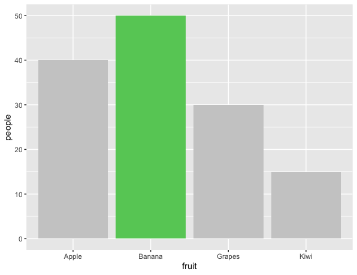
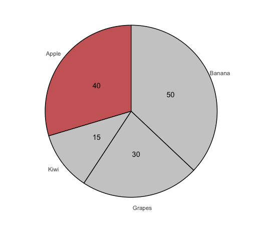
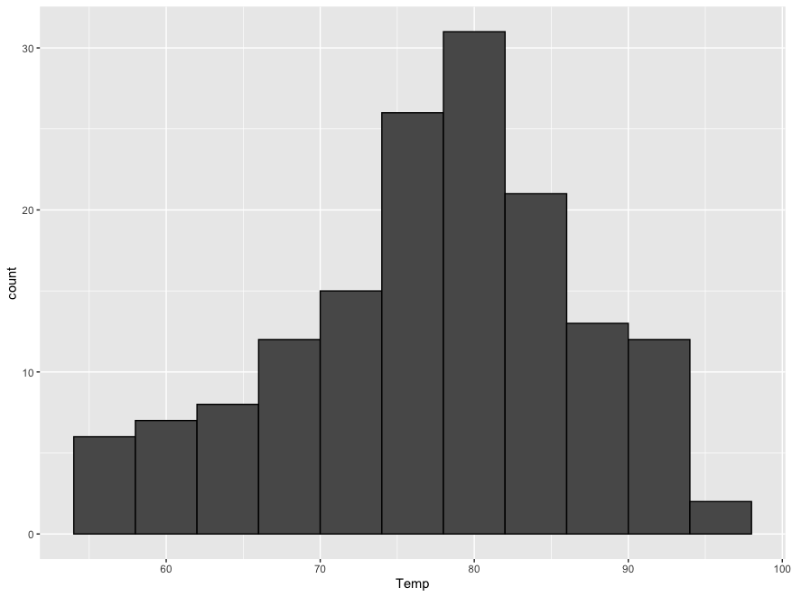
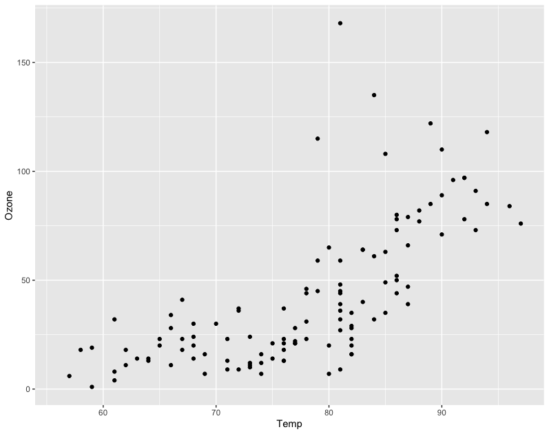

# Section 01. 기초 통계 이론

[Unit 1-1. 데이터와 통계](##Unit 1-1.-데이터와-통계)

[Unit 1-2. 자료의 형태와 그래프](##Unit 1-2. 자료의 형태와 그래프)

[Unit 1-3. 자료의 해석](##Unit 1-3.-자료의 해석)

[Unit 1-4. 탐색적 자료분석](##Unit 1-4.-탐색적 자료분석)

[Unit 1-5. (참고) 머신러닝, 딥러닝과 통계](##Unit 1-5.-(참고)-머신러닝, 딥러닝과 통계)

  이번 과정은 궁극적으로, R 프로그래밍을 통해 데이터를 원하는 형태로 가공하고, 통계적 기법을 활용하여 수집된 데이터로부터 얻을 수 있는 시사점을 보고서로 담는 일련의 과정을 살펴봅니다. 그 과정에서 사용되는 이론과, 프로그램 기법들을 기초 수준에서 다뤄보면서 데이터 분석 실무가 어떻게 진행되는지를 경험해 보실 수 있을 것입니다. 과정 중 다루는 내용은 대부분 기초적인 수준에서 진행 될 것이기 때문에, 좀 더 심도있는 활용을 원하시거나 깊은 수준의 이론을 공부하고 싶으신 분들은 별도의 과정을 통해서 학습하실 수 있습니다.

  Section 01. 에서는 통계 분석 기법, 그리고 통계 처리를 위한 프로그램 "R" 을 다루기에 앞서, 통계란 무엇인지에 대해서 배웁니다. 통계를 이해하기 위해서 필요한 각종 용어들과 개념들의 정의, 데이터의 성격을 파악하기 위한 특징들과 대표적인 통계량들을 배우고, 데이터 분석에 앞서 주어진 데이터에 대해서 파악해보는 과정인 "탐색적 자료분석"을 같이 진행해봅니다.

## Unit 1-1. 데이터와 통계

### 통계란?

  통계학은 자료를 수집, 재구성, 요약, 분석하여 결론을 도출하는 일련의 과학 이론 입니다. 통계학을 공부하면 자료를 다루는 방법, 자료의 의미와 성질을 파악하는 방법을 배울 수 있고, 수학적인 근거에 따라 사회적/자연적 현상을 귀납적으로 증명하는 방법을 배울 수 있습니다.

  흔히 빅데이터의 시대라고 칭하는 요즘은, 우리 생활의 거의 모든 부분에서 데이터들이 수집되고 있고, 이 데이터를 유용하게 활용할 수 있는 방법들을 많은 사람들이 고민하고 있습니다. 그렇기 때문에 통계학을 공부함으로서 수집된 데이터들이 어떤 현상을 말하고 있는지 파악할 수 있는 능력과 실무적으로 이런 수많은 데이터들을 다룰 수 있는 방법을 배울 수 있다는 점에서 통계학은 현대인들에게는 매우 핵심적인 공부라고 생각합니다.

#### 통계학의 용어

  앞으로 계속 마주치게 될 통계학의 기본적인 용어들에 대해서 살펴보겠습니다.

- **모집단(Population)** : 연구자가 알고 싶어 하는 대상 / 집단 전체

  > 대한민국 국민들의 키

- **표본(Sample)** : 모집단에서 선택된 부분집합

  > 나랑 가장 친한 한국 친구 3명의 키, 우리 아들 학급 친구들의 키, 내가 지금부터 만나는 10명의 키

- **통계(Statistic)** : 사회적 현상 혹은 자연적 현상을 규명하기 위해 수집된 각종 *데이터*의 요약

  > 직장인의 **평균** 키, 강좌 수강생들의 **평균** 연령, 연금을 수령하기 시작하는 **최소** 나이, 강좌 수료에 걸리는 **총**시간

- **데이터(Data)** : 측정이나 관측을 통해서 *추측*할 수 있는 *변수*의 값

  > 172cm, 168cm, 203cm, 155cm 

- **변수(Variable)** : 매 번 다른 값으로 추측할 수 있는 특성이나 성질

  > 나의 키 : 아침에는 172.552cm, 점심때는 172.551cm, 20년 전에는 113.241cm

- **확률 변수(Random Variable)** : 확률적인 결과에 따라 결과값이 바뀌는 변수

  >주사위를 던졌을 때 나오는 수 (1~6), 이번 주 로또 추첨에서 가장 먼저 뽑히는 수 (1~45)

  이번 과정에서 우리가 수행하려는 목표를 통계학의 용어로 설명하면 아래와 같은데요, 어떤 느낌이 드실 지 한번 읽어봅시다.

>   우리는 앞으로 `모집단`의 특성에 대한 가설을 세울것이고, 이 `모집단`의 특성에 영향을 주는 많은 `변수`들이 `확률 변수`라고 가정하여 수학적 이론에 따라 그 가설을 증명하는 방법을 배울것입니다. 수집된 여러가지 `데이터`들이 `표본`의 역할을 할 것이고, 이 `표본`들로 부터 산출되는 여러가지 `통계`를 이용하면 `모집단`의 특성을 설명하거나, `모집단`에 대해 세운 가설을 증명할 수 있습니다.

  통계학의 매력적인 부분 중 하나는, 사회적 현상을 데이터(표본)에 기반하여 수학적으로 증명할 수 있게 만들어 준다는 점 입니다. 실제로 통계학의 많은 기법들은 "확률론", "해석학", "수리통계학" 에 의해 수학적으로 증명된 이론이며, 많은 수의 사회 현상에 대한 연구 논문 마지막에는 특정 사회 현상을 관찰할 수 있는 모의 실험에 대해 자신의 가설이 통계적으로 효과가 있다는 것을 보임으로서 마무리 됩니다. 이로 인해 사회 과학이라는 말이 성립할 수 있게 됩니다.

### 기술 통계와 추론 통계

  통계를 데이터를 다루는 목적에 따라 크게 두 분류로 나누면 기술 통계(Descriptive Statistics)와 추론 통계(Inferential Statistics)로 나눌 수 있습니다.

#### 기술 통계(Descriptive Statistics)

  기술 통계에서 기술(Descriptive)의 사전적 의미는 자세히 설명하거나 그려서 설명한다는 의미입니다. 기술 통계는 그야말로 주어진 데이터 이용하여 상황이나 현상을 누군가에게 설명하기 위한 통계적 기법들을 말합니다. 우리가 흔히 "통계" 하면 떠오르는 것 처럼, 평균을 구하고, 갯수를 세어 집계를 하고, 그래프를 그리는 등의 방법들이 대표적인 기술 통계에 속합니다. 

##### 기술 통계의 요소들

  앞으로 우리가 과정을 통해 주로 배우게 될 통계의 많은 요소들이 기술 통계적 요소입니다. 이번 섹션에서 대표값, 산포도, 그래프 등에 대해 배우고 기술 통계적 통계량을 통해 주어진 데이터의 특성을 파악하는 "탐색적 자료분석"을 진행하게 됩니다.

* 대푯값 (평균, 중앙값, 최빈값 등)
* 산포도(분산, 표준편차, 사분위 값 등)
* 공분산과 상관계수
* 확률 분포
* 그래프

#### 추론 통계(Inferential Statistics)

  통계적 추론이라고도 하는 추론 통계 (Inferential Statistics)는 이전에 통계에 대해서 잘 모르던 사람들에게는 생소한 개념일 수 있습니다. 추론 통계에서는 표본에서 수집된 정보들을 모집단에 대한 정보로 일반화 시키는 과정을 다루며 설문조사를 기반으로 선거 결과를 예측한다거나, 실험을 위해 세운 가설이 올바른 가설이었는지 증명하는 방법 등이 추론 통계에 속합니다.

##### 추론 통계의 요소들

   추론 통계는 추정(Estimation)과 검정(Hypothesis Test)으로 이루어 집니다. 추정은 어떤 값을 추측함에 있어서 데이터에 기반해 그 값중 이론적으로 가장 합리적인 값을 찾기 위한 방법입니다. 검정은 가설을 수립하고 수집된 데이터를 기반으로 그 가설이 올바른 추측인지, 주장하기에 무리가 있는 추측인지를 판정합니다. 이번 과정의 후반부에서는 통계적 가설 검정에 대해서 간략히 다룹니다.

- 추정
- 검정

### 정리

  통계는 수집된 데이터를 재구성하고 분석하여 결론을 내리는 일련의 과정입니다. 데이터는 일반적으로 모집단의 표본으로서 얻어지며, 우리는 표본에 대한 통계량을 산출하는 것으로 사회적, 과학적 현상에 대한 결론을 내릴 수 있습니다. 다양한 통계 용어의 정의를 살펴보았고, 통계가 데이터를 다루는 두 방법인 기술통계와 추론 통계를 살펴보았습니다. 다음 시간부터는 기술 통계의 여러 요소들을 하나씩 살펴보겠습니다.

## Unit 1-2. 자료의 형태와 그래프

### 변수와 자료의 형태

  우리는 이제 어떤 변수(또는 확률 변수)에 대한 실제 관측값, 또는 측정값으로서 수집된 데이터를 다루게 될 것입니다. 이 변수는 변수는 크게 질적 변수와 양적 변수의 두 가지로 구분할 수 있으며 각각의 변수가 또 두 가지로 세부 분류되어 작게는 네 분류로 나눌 수 있습니다. 변수의 성질, 즉 데이터의 성질에 따라 분석하는 방법이나 그래프로 나타내는 방법이 서로 달라지기 때문에 먼저 변수의 종류에 대해서 살펴보아야 합니다. 

#### 질적(Qualitative) 변수

  질적 변수는 이름, 종교, 거주지역, 교육 수준, 소득 수준 같이 어떤 숫자나 우열을 가릴 수 없이 단지 조사 대상의 성질을 나타내는 변수를 말합니다. 질적 변수는 다시 명목형 변수와 순서형 변수로 나뉩니다. 

- **명목형(Nominal)** : 크기나 순서에 대한 의미는 전혀 없이 부여된 이름 그 자체로서 의미가 부여되는 변수

  > 입고 있는 옷의 색상, 종교, 살고 있는 지역, 성별, 지지하는 정당

- **순서형(Ordinal)** : 임의의 기준을 부여하는 경우 기준에 따른 순서에 의미가 부여될 수 있는 변수

  > 교육 수준 (중졸 > 고졸 > 대졸 이상), 소득 수준 (낮음 > 중간 > 높음)

#### 양적(Quantitative) 변수

  양적 변수는 숫자로 표현 가능하며 순서를 매길 수 있는 형태로서, 측정되거나 갯수를 세어 표현할 수 있는 변수를 말합니다. 숫자로 표현되는 값이 어떤 의미를 가지게 되며, 덧셈, 뺄셈 등 연산을 할 수 있고, 연산의 결과도 의미가 있는 변수입니다. 양적 변수도 마찬가지로 이산형 변수와 연속형 변수로 나뉩니다.

- **이산형(Discrete)** : 셀 수 있는 값을 가지는 변수

  > 자녀의 수, 방의 갯수, 오늘 만난 사람의 수, 나이

- **연속형(Continuous)** : 유한한 두 숫자 사이의 값을 가지며 측정을 통해 얻을 수 있는 변수

  > 책상의 길이, 아침 기온, 5km를 달리는 데 걸린 시간

  ### 자료의 척도(Levels of Measurement)

  어떤 사람이나 사물의 특성을 나타내는 변수가 주어졌을 때, 변수에 지정된 값(자료)이 어떻게 분류되었는지, 어떻게 세어졌는지, 어떻게 측정되었는지에 따라 변수에 지정된 값의 특성이 달라집니다. 자료가 갖는 정보의 유형에 따라 우리는 자료를 명목척도, 서열척도, 등간척도, 비율척도의 네 가지의 체계로 분류하는데, 이를 자료의 척도라고 합니다. 각 척도는 순서를 매길수 있는가? / 각 단계가 균등한 간격을 가지는가? / 절대값이 존재하는가? 의 측면에서 서로 다른 특성을 가집니다. 각 척도가 가지는 특성과 정보에 대해서 살펴보겠습니다.

#### 명목척도(Norminal)

  명목 척도는 명목형 변수에서 다룬 것과 같이 이름 그 자체로서 의미가 부여되는 정보로서 표현되는 숫자로 표현한 경우입니다. 운동 선수의 등 번호(11번, 27번), 우편번호(01623, 13884) 등을 예로 들 수 있습니다. 이 정보를 가지고는 서로간의 구별만 가능할 뿐, 등번호 11번은 27번보다 어떤 점에서 더 낫다고 말 할 수 없으며, 11번이 27번보다 16만큼 어떻다고 말 할수도 없습니다. 또한 등번호 0번을 가진 사람은 선수가 아니라는 절대 0값의 의미를 갖지도 않습니다.

- 가능한 연산 : =  | 순서 : X | 균등한 간격 : X | 절대값 존재 : X

#### 서열척도(Ordinal)

  서열 척도는 명목 척도와 같이 대상을 구분해주는 특성을 가짐과 동시에 대상끼리의 순위 관계에 대한 정보를 담고 있습니다. 학급 석차 (1등, 2등, 3등), 학년(1학년, 2학년, 3학년), 성적(A+, A, B+, B, C+, C, D, F) 등을 예로 들 수 있습니다. 이 정보는 서로간의 구별이 가능할 뿐더러, 학급석차에 따른 순서를 매길 수 있고, 성적에 따른 순서를 매길 수 있습니다. 다만 6등이 8등보다 잘하는 만큼 1등이 3등만큼 잘한다 라고 말할 수 없으며, 등수를 매길 수 없는 사람을 0등 이라고 표현하거나, 성적을 매길 수 없는 대상에게 Z 등급이나 0 등급 등을 매기지는 않습니다.

- 가능한 연산 : > < = | 순서 : O | 균등한 간격 : X | 절대값 존재 : X

#### 구간척도(Interval)

  구간 척도는 서열 척도의 성질을 모두 가지면서도, 속성값이 갖는 차이가 균등하며, 그 차이 역시도 어떠한 의미를 가지고 있습니다. 온도 (10℃, 14℃, 16℃), 시험 점수(100점, 94점, 88점) 등을 예로 들 수 있습니다. 온도에 따른 순서, 시험 점수에 따른 순서를 매길 수 있을 뿐더러, 14℃는 10℃보다 4℃ 따뜻한 것이고, 이는 100℃가 96℃보다 4℃ 따뜻한 것과 같은 정도를 나타냅니다. 시험 점수 역시 40점보다 20점이 20점 분량의 문제를 더 맞춘것이라면, 40점이 비슷한 분량의 문제를 더 맞췄다면 60점이 될 것입니다. 다만 0℃는 온도가 존재하지 않는 것이냐, 혹은 0점은 시험을 보지 않은 것이냐 한다면 그렇지는 않습니다. 구간 척도에서 0의 의미는 비교의 기준이 되는 어떤 지점을 나타내는 것이지, 측정량의 값 자체가 존재하지 않기 때문에 0이 되는 것은 아닙니다.

- 가능한 연산 : > < = + - | 순서 : O | 균등한 간격 : O | 절대값 존재 : X

#### 비율척도(Ratio)

  비율 척도는 서열척도, 구간척도가 가지는 정보를 모두 가지고 있으면서, 비율에 관한 정보까지 담고 있습니다. 사실 비율에 관한 정보를 담고 있다고 하면 잘 와닿지 않기 때문에 절대 영점의 존재를 가지고 생각해 보는 것이 더 좋을 때가 많습니다. 대표적으로는 키(172.8cm, 181.1cm, 154.2cm), 몸무게(76.4kg, 55.9kg), 시간(2분 11초, 40초) 등이 있습니다. 순서를 매길 수 있고, 각 구간의 간격이 모두 동일하다는 점을 직관적으로 아실 수 있을 뿐더러, 절대 0값의 존재로 인해 어떤 물건의 크기가 0cm라면, 그 물건이 존재하지 않는다는 말과 동일하며, 어떤 사람의 몸무게가 0kg이라면 그것 역시 그 사람이 존재하지 않는다는 말과 동일합니다 (측정을 통해 0 값이 관측되었다는 말 자체가 모순처럼 느껴질 수도 있습니다).

- 가능한 연산 : > < = + - × ÷ | 순서 : O | 균등한 간격 : O | 절대값 존재 : O

  변수의 형태와 자료의 척도를 잘못 이해하면 자료를 해석하는 과정에서 잘못된 결론을 도출하거나, 자료를 시각화 하는 과정에서 적절하지 못한 형태의 그래프를 선택하는 잘못을 할 수 있습니다.

### 그래프 표현

  데이터 분석에서 그래프는 분석가, 또는 분석가가 자료를 설명하는 대상에게 데이터의 주요한 특징과 경향을 한눈에 알 수 있도록 해주는 좋은 기법입니다. 그렇기 때문에 자료가 가지는 특성에 따라 자료의 성격을 가장 잘 보여주는 그래프를 적절하게 선택하여 시각화 할 필요가 있습니다. 분석 과정에서 주로 사용하게 되는 여러 그래프들의 특성과, 그래프에 알맞은 자료 형태에 대해 간략히 알아보겠습니다.

#### 바 차트

  질적 변수들은 대개 바 차트나 파이 차트를 통해 표현할 수 있습니다. 바 차트는 굉장히 많은 경우에 사용할 수 있으며, 한 눈에 명료하게 인식되는 범위에서도 많은 정보를 담을 수 있기 때문에 아주 좋은 그래프입니다.

   바 차트에서는 각각의 항목이 다른 항목에 비해 얼마나 많이 또는 적게 발생하는지 서로간의 비교를 하기에 적합합니다. 그러면서도 데이터의 전체적인 경향을 알 수도 있습니다. 

  일반적으로 순서형 변수의 경우 순서에 따라 가로축의 항목을 배열하고, 명목형 변수의 경우 보는 사람이 직관적으로 찾기 쉽도록 알파벳이나 가나다 순으로 배열합니다. 각 항목별로 발생하는 숫자의 많고 적음이 상대적으로 중요한 경우 막대의 크기 순으로 정렬 하기도 합니다.

  그래프를 그릴 때는 기본적으로 다양한 색상을 사용하는 것은 지양하는 편이 좋습니다. 가급적 적은 수의 색상을 사용하고, 강조하고자 하는 부분에만 색상을 사용하면 자료를 통해 설명하고자 하는 부분을 더 명확하게 드러낼 수 있습니다.

##### 강점

- 질적 변수의 전체적인 경향을 잘 보여준다
- 각 값들 간 직관적인 대/소 비교가 가능하다
- 가로축에 값의 유형, 세로축에 빈도 등을 표기하여 정확한 값을 알기 좋다

#### 파이차트

  파이 차트도 질적 변수에 사용하기 좋은 그래프입니다. 다만, 사람이 파이 차트를 인식하는 것은 바 차트를 인식하는 것 보다 더 여렵기 때문에 그래프 작성에 많은 제약이 따르고, 때문에 보여주는 정보량이 더 적습니다.

   파이 차트는 전체 원형을 100%로 잡을 때, 특정 값이 전체에서 차지하는 비중을 더 강조합니다. 때문에 변수에서 특정 값이 차지하는 비중을 강조해야 할 때 사용하기 좋지만, 각 값들끼리의 비교에서는 바 차트보다 시인성이 떨어집니다.

  대신 여러 개의 차트를 나열해야 하는 상황에서는 바 차트를 여러 개 나열하는 경우 보여지는 정보량이 너무 많아 복잡해질 수 있기 때문에, 이런 경우에는 간단한 형태의 파이 차트를 여러 개 나열하면 정보를 인지하기에도 좋고, 시인성도 더 좋아집니다.

  그리고 파이 차트는 6개 이상의 값을 한번에 표현하기에 적절하지 않습니다. 원형이 너무 쪼개지면서 어떤 값에도 집중하기 어렵게 보이기 때문입니다. 값이 6개 이상의 유형으로 표현된다면, 중요하지 않은 값은 "기타" 등의 값으로 합쳐서 처리하거나, 바 차트를 이용하는 편이 더 좋습니다.

  파이 차트의 시인성을 극대화 하기 위해서는, 가장 큰 범주를 우측 상단에, 그다음 범주를 좌측 상단에 배치하고 나머지 범주를 시계방향 순으로 나열하는 것이 가장 좋습니다.

  실제 보고서 작성 과정에서 질적 변수에 대한 그래프를 삽입하다 보면, 대부분의 그래프가 바 차트로 구성되어 전체적으로 지루한 느낌을 줄 때가 있습니다. 그런 경우 파이 차트는 훌륭한 대안이 됩니다만, 적절한 위치에 사용하지 못하면 바 차트에 비해 제공되는 정보량이 적어 설명하고자 하는 내용을 충분히 설명할 수 없게 될 수도 있습니다. 이 점에 유의해야 합니다.

##### 강점

- 질적 변수에서 특정 값이 차지하는 비율을 가장 잘 보여준다
- 여러 개의 그래프를 나열해야 할 때 파이 차트를 여러 개 그리는 편이 바 차트를 여러 개 그리는 것 보다 좋다

[R 코드 링크 참고](https://stackoverflow.com/questions/47752037/pie-chart-with-ggplot2-with-specific-order-and-percentage-annotations)

#### 히스토그램(Histogram)

  다음과 같이 양적 변수인 화씨 온도(℉)의 측정값이 150개 주어졌다고 생각했을 때, 데이터의 특성을 파악해보기 가장 간단한 방법 중 하나는 도수 분포표(Frequency Distribution)의 형태로 데이터를 재구성 하는 것입니다.

> 67 72 74 62 56 66 65 59 61 69 74 69 66 68 58 64 66 57 68 62 59 73 61 61 57 58 57 67 81 79 76 78 74 67 84 85 79 82 87 90 87 93 92 82 80 79 77 72 65 73 76 77 76 76 76 75 78 73 80 77 83 84 85 81 84 83 83 88 92 92 89 82 73 81 91 80 81 82 84 87 85 74 81 82 86 85 82 86 88 86 83 81 81 81 82 86 85 87 89 90 90 92 86 86 82 80 79 77 79 76 78 78 77 72 75 79 81 86 88 97 94 96 94 91 92 93 93 87 84 80 78 75 73 81 76 77 71 71 78 67 76 68 82 64
> 71 81 69 63 70 77 75 76 68

| 구간 (Bins) | 도수 (Frequency) |
| :---------: | ---------------- |
|    54~58    | 6                |
|    59~62    | 7                |
|    63~66    | 8                |
|    67~70    | 12               |
|    71~74    | 15               |
|    75~78    | 26               |
|    79~82    | 31               |
|    83~86    | 21               |
|    87~90    | 13               |
|    91~94    | 12               |
|    95~98    | 2                |

  이렇게 도수 분포표의 형태로 정리하면, 마치 "온도가 속한 구간" 이라는 순서형 변수에서 수집된 데이터들의 갯수 형태로 자료를 재정리 할 수 있습니다. 이것을 마치 바 차트와 같이 표현한 그림이 히스토그램입니다.

  히스토그램은 바 차트가 가진 여러 장점을 그대로 가집니다. 양적 변수에서 수집되는 데이터의 전체적인 경향을 알 수 있고, 어느 구간에서 가장 많은 데이터가 수집되었는지도 알 수 있습니다. 다음 Unit에서 다시 다루겠지만, 히스토그램의 형태만 보고도 중심화 경향과 산포도를 어느정도 추측할 수 있습니다. 

  히스토그램을 그리는 데 있어 가장 관건은, 수집된 데이터의 양에 따라 구간(Bins)을 얼마나 나누는가 입니다. 데이터가 수집되는 범위에 비해 구간을 너무 좁게 나누면, 막대의 수가 지나치게 많아짐과 동시에 각 막대들이 적당한 높이를 확보하지 못해 데이터의 전체적인 경향을 알기 힘들어집니다. 반대로, 데이터가 수집되는 범위에 비해 구간을 너무 넓게 나누면, 많은 정보들이 한 구간에 합쳐져 데이터의 세부적인 특성을 놓치게 됩니다.

##### 강점

- 양적 변수의 전체적인 경향을 비롯해 중심화 경향, 산포도 등 많은 정보를 알 수 있다
- 바 차트와 마찬가지로 직관적인 비교가 가능하며 시안성이 좋다

#### 산점도(Scatter Plot)

  대부분의 데이터 분석은 관심있는 어떤 현상이나 성질(Y)에 영향을 주는 요인(X)들이 무엇인지 알아내는 것이 관건이기 때문에(X가 Y에 주는 영향), 여러 변수들을 동시에 다룹니다. 키와 몸무게, 매출과 순이익, 물건의 가격과 판매량 처럼 밀접하게 관련이 있어 보이는 두 변수들 사이의 관계를 그래프로 나타내는데 가장 많이 사용되는 그래프가 산점도입니다. 

  산점도는 2차원 공간인 평면에서 x축과 y축을 각각 관심있는 두 개의 변수로 설정하여, x축 변수의 값과 y축 변수의 값을 마치 좌표처럼 생각해서 평면에 표현한 그림입니다.

  점들이 모여있는 형태와 두 변수 사이의 경향성을 한눈에 파악할 수 있고, 전체적인 경향에 엇나가는 데이터들을 한 눈에 알 수 있기 때문에 두 개 이상의 변수를 다루거나 Y에 영향을 주는 X값을 찾아내는 분석의 맨 첫단계는 거의 항상 산점도를 그리는 것으로 시작합니다.

  특히 산점도는, 각각의 데이터를 점 하나로 표현하는 그래프 방식이기 때문에, 다른 그래프에 비해서 점의 모양을 바꾸거나, 점의 색깔을 바꾸거나, 점의 크기를 바꾸는 등의 방법으로 3차원 (변수가 3개), 4차원 (변수가 4개) 혹은 그 이상의 데이터들 간의 관계도 대략적으로 확인해볼 수 있습니다. 물론 그만큼 직관성은 떨어지게 되겠지만요.

  앞으로 데이터를 다루는 과정에서 산점도를 통해 방향성을 잡고 시작하는 경우를 많이 보게 될 것입니다.

##### 강점

- 여러 양적 변수들 간의 관계와 전체적인 경향을 한 눈에 확인 할 수 있다
- 데이터가 집중된 일반적인 패턴을 벗어난 값들이 존재하는지 바로 알 수 있다
- 하나의 데이터가 하나의 점을 구성하기 때문에 한 데이터에 대한 여러 속성을 한번에 확인할 수 있다

### 정리

  이번 시간에는 변수의 네 가지 형태와 자료의 네 가지 척도에 대해서 알아보았습니다. 사실 변수의 형태와 자료의 척도는 매우 비슷한 이야기처럼 보입니다. 변수의 형태는 우리가 관심을 가지는 "특성이나 성질" 에 대한 이야기라면, 자료의 척도는 수집된 데이터를 계산할 때 어떤 점을 유의해야 하는지에 대한 특성이라고 이해하면 좋을 것 같습니다.

  또한 보고서 작성에서 주로 사용하게 될 네 가지 그래프에 대해서도 살펴보았습니다. 실제 분석 과정에서는 어떤 자료의 어떤 면을 보여주기 위해 어떤 그래프를 선택할 것인지가 아주 중요한 고민거리입니다. 앞으로 다양한 보고서나 분석 자료들을 읽어나가시는 과정에서 그래프가 어떤 정보를 보여주려고 하는 것인지, 작성자가 주장하고자 하는 내용이 그래프에 적절하게 담겼는지를 유심히 살펴보신다면 나중에 직접 보고서를 작성하시는 과정에서도 큰 도움이 될 것입니다. 다음 시간에는 그림이 아니라 통계치, 숫자로써 데이터를 해석하는 방법을 알아보겠습니다.

## Unit 1-3. 자료의 해석

### 중심화 경향(Central Tendency)

#### 최빈값

#### 평균

#### 중앙값

### 산포도(Dispersion)

#### 분산

#### 표준편차

#### 사분위범위

###  다른 통계량들

#### 공분산과 상관계수

#### 왜도와 첨도

### 정리

## Unit 1-4. 탐색적 자료분석

## Unit 1-5. (참고) 머신러닝, 딥러닝과 통계

